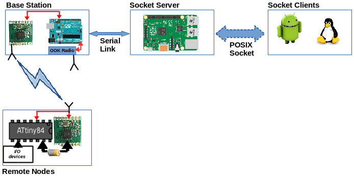

# Naarad
A simple house monitor and control system. 

The *Naarad* system is a network of remote Nodes with a radio operating
in the [ISM band](https://en.wikipedia.org/wiki/ISM_band) and a Base
Station with an [RFM69CW](http://www.hoperf.com/rf_transceiver/modules/RFM69CW.html) (RFM) packet radio, currently connected to an
Arduino UNO.  The UNO talks to a Linux-based computer (currently a
Raspberry PI (RPi)) via the serial connection.  The RPi also listens
for incoming socket connections.  Commands for the *Naarad* network
are either generated at the RPi or arrive at the socket (e.g. from a
remotely connected device).  Commands meant for the UNO or the remote
Nodes are sent to the UNO via the serial connection.  The server on
the UNO then transmits the commands for the remote Nodes via the RFM
or via another radio for remote [OOK](https://en.wikipedia.org/wiki/On-off_keying)
devices.  Similarly, information from remote Nodes is received at the 
UNO via the RFM and immediately transferred to the RPi for consumption 
via the serial connection. The block level system diagram looks like this:

This repository has the code for the three components of the Naarad system: 
  * The code running on the MCUs on the remote nodes is in the [Nodes](Nodes) directory
  * The code running on the Arduino UNO on the Base Station is in the [BaseStation](BaseStation) directory
  * The code running on the central socket server (Raspberry Pi) is in the [RPi](RPi) directory

### Resources
The communication with the RFM is done using the
[JeeLib](https://github.com/jcw/jeelib) library from
[JeeLabs](https://jeelabs.org).

The communication hardware on the remote Nodes is derived from the
[TinyTx](https://nathan.chantrell.net/tinytx-wireless-sensor) design.
For programming the ATTiny84 using an Arduino, I followed the
instructions from [here](https://nathan.chantrell.net/20120225/an-attiny-based-wireless-temperature-sensor/).

[This](http://www.gammon.com.au/power) article by [Nick Gammon](http://www.gammon.com.au/forum/bbshowbio.php?bbuser_id=1) is an excellent resource for techniques to reduce power consumption on MCU. While the code here is for Arduino (Atmega328P), some of the techniques apply to other Atmel processors.  A similar article sepecifically for ATTiny84 would be great.  This also has a post with very useful information about batteries (including self-drainage rates etc.).
